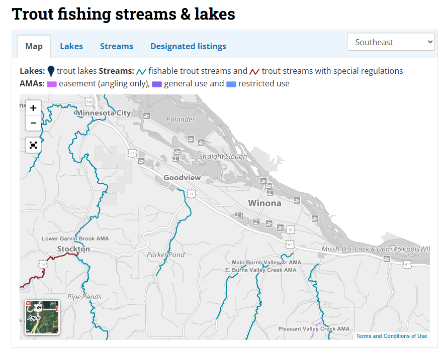

# What are some fun things to do in Winona?  

*Let's write this document in Markdown.  Here's a tutorial: <https://www.markdownguide.org/basic-syntax/>*

There are lots of fun things to do in Winona.  Here's a short list:

- Ice skating

- South East Minnesota is full of amazing trout streams.  The MN DNR has a [resource page with maps](https://www.dnr.state.mn.us/fishing/trout/index.html). The closest streams to campus are [Garvin Brook](https://maps.app.goo.gl/kS5dTASksrcMZxjz5), [Gilmore Creek](https://maps.app.goo.gl/TQmXCN1Gr5FTkcAV9), [East Burns Valley Creek](https://maps.app.goo.gl/k5oZZEnXCym7CEfWA), and [Pleasant Valley Creek](https://maps.app.goo.gl/MT3xDR3qNfWsnhQ58).   

- Rock climbing is the best thing to do in Winona.

- The ice climbing wall is one of the [best in the country](https://www.cityofwinona.com/facilities/facility/details/winonaicepark-57)

- Golfing at Westfield Golf Course <https://www.westfieldgolfclub.com/about-us/> 

- Winona area has many hiking trails and forests free to explore. One of my favorites is [Cherry Hill](https://www.trailforks.com/region/cherry-hill-16425/?activitytype=1&z=13.0&lat=44.06516&lon=-91.75138&content=trails,labels,region,poi,directory,polygon,waypoint,nst,routes_featured), as it is full of many small biking trails that extend for miles overlooking Goodview. 

- You can rent a canoe at the "Lake Lodge Recreation Center" by Winona Lake <https://www.cityofwinona.com/Facilities/Facility/Details/Lake-Lodge-Recreation-Center-3>

- If you are looking for a pretty spot to view the town of Winona, head to the Garvin Heights Lookout! Here, you will experience not only scenic views, but also hiking trails, biking trails, picnic spots, and more. Click this link to find the description and address: 
<https://visitwinona.com/directory/garvin-heights-park/>.

- Walking by the lakes

  # Disc Golf in Winona

In Winona, there are three disc golf courses. One behind Saint Marry's University, one after the bridge across the lake when driving from the highway to Winona State, and one along the lake at the park by the Clinic and YMCA. 

Ranking these courses, number 1 goes to Saint Mary's, number 2 goes to the one by the Y, and dead last goes to the one by the bridge. 

Saint Mary's is scenic, serene, and offers an amazing blend of nature hiking and a fun and challenging course.

The lake side course offers a fun and challenging experience with many unique holes, and is located in the center of the town, so its not far from anywhere. 

Lastly, the one by the bridge is close to WSU, but is lacking in many features and is often plagued with overgrown grass, causing discs to be lost in the middle of the fairway, and is overall uninteresting and featureless.

### West gate Bowling ###
They have a great bar and grill and bowling from 3pm to 11pm

